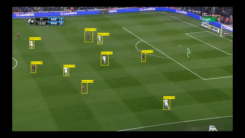

# DesigningNN-project — Microservices Edition

## Проект выполнили:

- Фронин Иван
- Гумеров Ильсур
- Андрей Киселев
- Пичугов Виктор



---

## Описание

Этот проект предоставляет сервис по детекции объектов на футбольном поле.

- **frontend**: Интерфейс пользователя для взаимодействия с системой.
- **backend**: API-сервис для обработки запросов.
- **model**: Логика, связанная с обработкой данных, машинным обучением или вычислениями.

Проект включает в себя все необходимые настройки для локального запуска с помощью Docker.

---

## Функциональные возможности

- Разделение приложения на независимые микросервисы.
- Лёгкое взаимодействие между сервисами через API.
- Возможность масштабирования каждого компонента приложения.
- Интеграция с модельной логикой для выполнения вычислений.

---

## Как запустить проект

### 1. Клонирование репозитория

Сначала клонируйте репозиторий:

```bash
git clone https://github.com/Klowest/DesigningNN-project.git
cd DesigningNN-project
git checkout microservices
```

### 2. Запуск проекта

Для запуска проекта с помощью Docker Compose выполните команду:

```bash
docker-compose up --build
```

Эта команда выполнит сборку и запуск всех сервисов, указанных в файле docker-compose.yaml.

### 3. Открытие приложения
После того как контейнеры будут запущены, откройте браузер и перейдите по следующему адресу:

```bash
http://localhost:3000
```

Убедитесь, что порт в docker-compose.yaml совпадает с тем, который указан в настройках.

## Структура проекта
```bash
DesigningNN-project/
│
├── backend/             # API-сервис
│   
│
├── frontend/            # Пользовательский интерфейс
│   
│
├── model/               # Логика модели/вычислений
│   
│
└── docker-compose.yaml  # Конфигурация для запуска всех сервисов
```